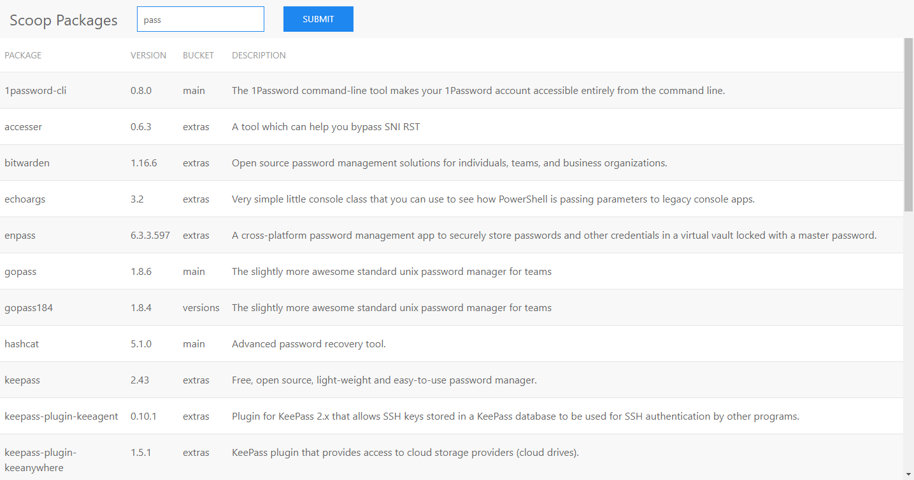

# scoop-spring-react

A back and front end for [Scoop](https://scoop.sh/)

This project example shows how to:
- Interact with a database through Hibernate
- Talk with an API (Spring in our case) through React

## Screenshot

